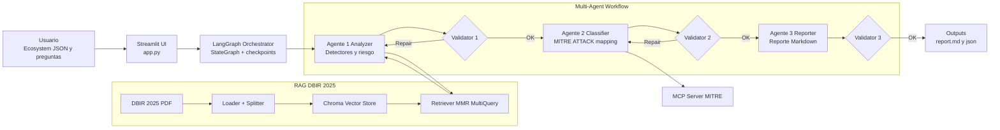

# DataSec Challenge

## Javier Montigel

## Objetivo 
Realizar un sistema multiagente que posea las características mencionadas a continuación y
pueda realizar las tareas propuestas para la creación de nuevos mecanismos detectivos:
Sistema: La solución debe ser una arquitectura multiagente compuesta por 3 agentes
específicos que implementen un pipeline secuencial de análisis de vectores de
ataque/riesgos, comparativa con el contexto del ecosistema a evaluar, y generación de un
reporte de detectores prioritarios.

## 🏗 Arquitectura Propuesta

