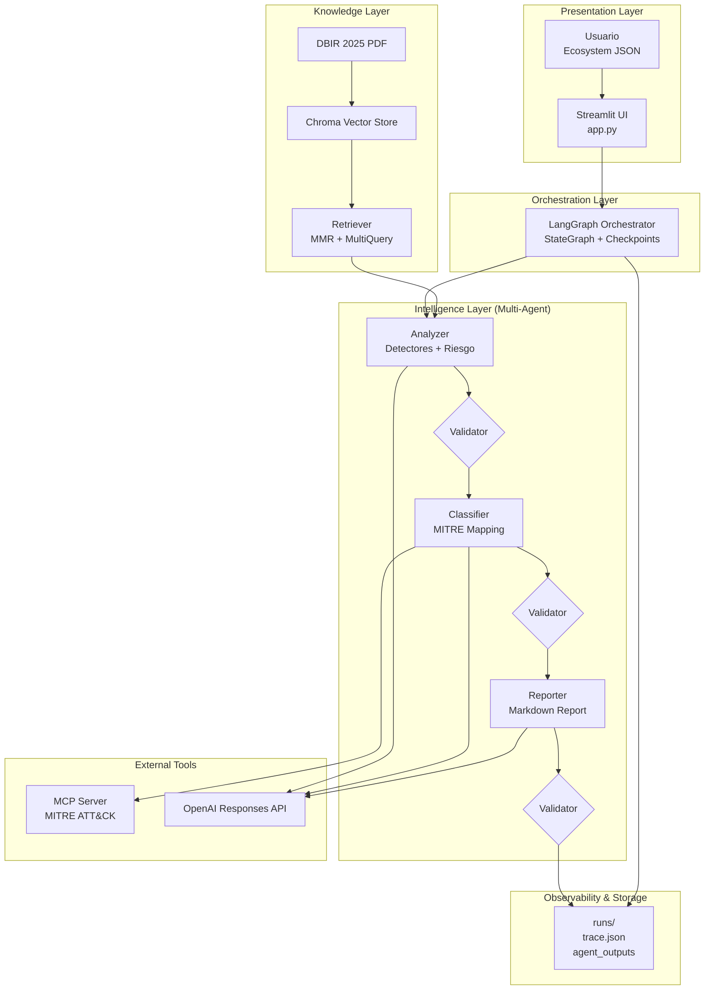

# DataSec Challenge

## Javier Montigel

## Objetivo 
Realizar un sistema multiagente que posea las características mencionadas a continuación y
pueda realizar las tareas propuestas para la creación de nuevos mecanismos detectivos:
Sistema: La solución debe ser una arquitectura multiagente compuesta por 3 agentes
específicos que implementen un pipeline secuencial de análisis de vectores de
ataque/riesgos, comparativa con el contexto del ecosistema a evaluar, y generación de un
reporte de detectores prioritarios.

## 🏗 Enterprise Architecture Overview




La arquitectura está diseñada en capas desacopladas: Presentation, Orchestration, Intelligence, Knowledge y Tools.
LangGraph controla el flujo con checkpoints y validaciones no lineales.
El RAG provee grounding en DBIR 2025 y el MCP conecta dinámicamente con MITRE ATT&CK sin hardcodear técnicas.
Toda ejecución es trazable por session_id para reproducibilidad.


### Instalación

```bash
pip install -r requirements.txt

```

### Ejecución

Cargar base de datos vectorial ChromaDB
```bash
python vector_stores.py
```

Interfaz grafica con Streamlit
```bash
cd src
streamlit run app_streamlit.py
```